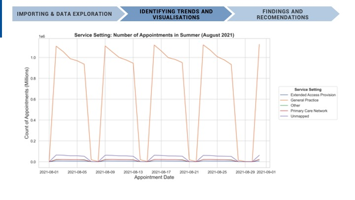

<h1>NHS - Appointments in General Practice</h1>
  <h3> Topics Covered</h3>
  

    Data Wrangling, Data Visualisation with Python (Plotlt, MatPlotLib, Seaborn), API calling, Web Scraping, Natural Language Processing, and Sentiment Analysis. 
 

Grade: __86% (Distinction)__

<h2>Assignment Overview</h2> 
  

The goal of this project was to explore NHS appointment data within primary care and determine what can be done to reduce and eliminate missed appointments by investigating two main areas of capacity and resource utilisation in the NHS.

Four datasets were used in this analysis and can be found in the repository. The first three datasets contain primary care appointment data in the NHS and the last dataset is health-related tweets scraped from Twitter.  

  

  
<h2>Findings and Recommendations - Final Stakeholder Presentation</h2> 

  

It is estimated the each missed appointment costs the NHS an average £30 per person, which may not seem like a lot but adds up to over £290 millions wasted in just half a year from people not attending their appointments and It is estimated that in the second half of 2022 5% of all appointments were missed. 

## The working order of how this project was approached is shown below and corresponds to chapters seen in the Jupyter Notebook
1. Setting Up the GitHub Repository
2. Importing and Exploring Data
3. Analysing the Data: Initial Exploration
4. Sentiment Analysis: NHS-related Twitter Data
5. Visualising and Identifying Initial Trends
6. Findings and Recommendations

