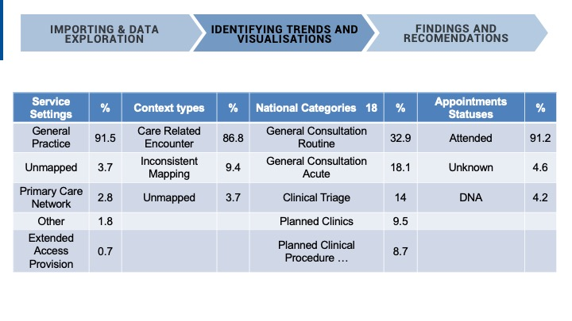
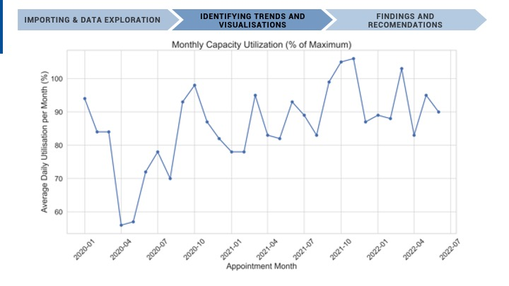
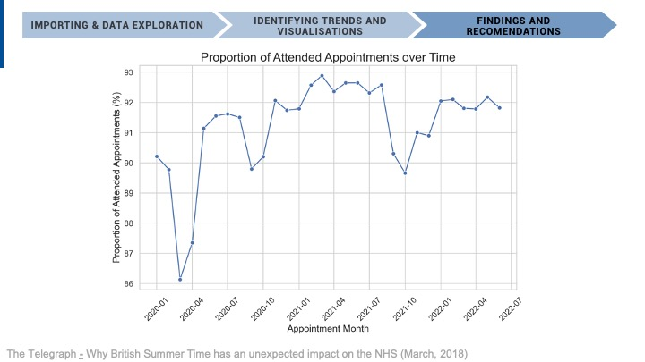
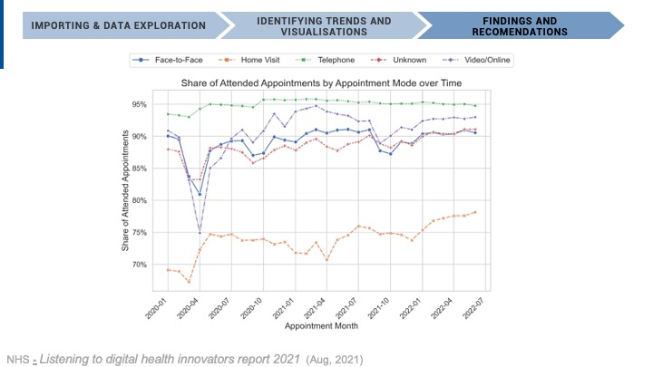

<h1>NHS - Appointments in General Practice</h1>
  <h3> Topics Covered</h3>
  

    Data Wrangling, Data Visualisation with Python (Plotlt, MatPlotLib, Seaborn), API calling, Web Scraping, Natural Language Processing, and Sentiment Analysis. 
 

Grade: __89% (Distinction)__

<h2>Assignment Overview</h2> 
  

The goal of this project was to explore NHS appointment data within primary care and determine what can be done to reduce and eliminate missed appointments by investigating two main areas of capacity and resource utilisation in the NHS.

Four datasets were used in this analysis and can be found in the repository. The first three datasets contain primary care appointment data in the NHS and the last dataset is health-related tweets scraped from Twitter.  

  

  
<h2>Findings and Recommendations - Final Stakeholder Presentation</h2> 

Below is the final stakeholder presentation for the NHS, encompassing a comprehensive analysis of appointment management challenges, capacity constraints, and innovative solutions. This presentation delves into key areas of concern, such as staffing shortages and resource utilisation, while offering strategic recommendations to improve overall efficiency and patient engagement in the healthcare system. Through data-driven insights and targeted action plans, we aim to support the NHS in enhancing its service delivery and addressing the critical issue of missed appointments.

Welcome to this presentation on NHS Appointments in General Practice. 

It is estimated that each missed appointment costs the NHS an average of £30 per person, which may not seem like a lot but adds up to over £290 million wasted in just half a year from people not attending their appointments. Additionally, it is estimated that in the second half of 2022, approximately 5% of all appointments were missed, highlighting a critical area for improvement in healthcare management.

Our analysis aims to address the pressing issue of missed NHS appointments by exploring two key areas: the adequacy of staff and network capacity, and the actual utilisation of resources. This exploration is particularly relevant to NHS ICBs, who are directly impacted by these challenges. 

Utilising three NHS-provided datasets on appointment data and a collection of healthcare-related tweets, we employed Python for its versatility in data processing and visualization. Collaboration was enhanced through the use of GitHub, a web-based platform that provides version control and collaborative features, ensuring efficient management and tracking of project developments

The approach taken is highlighted here where the data was first imported and sense checked for duplicates and outliers to begin the initial stages of data exploration. 

The imported data was then analysed to try and find answers related to the business problem and gauge capacity and resource utilisation. Visualisations were then created to show trends in the data. Finally, any relevant findings and future recommendations are discussed. 

To first get a better idea of the data, the different categories that were explored are highlighted here showing the corresponding number of values within each category. For example, there were a total of 5 service settings consisting of GP, Primary care network, other, unmapped and extended access provision. 3 context types, 18 total national categories and 3 appointment statuses. We also found that the data provided encompasses a total of 106 sub-ICB locations, providing a clearer understanding of the data landscape within the NHS.

As we are investigating changes over time, almost all the data was grouped by month. Here are example data tables between August 2021 and June 2022 showing the number of appointments per month in descending order and the number of records per month in chronological order. The Average number of appointments per month recorded was found to be around 27 million while the average number of records a month at approximately 75 thousand. This data was crucial in assessing the monthly capacity and utilisation of NHS appointments.

Moving onto our exploration of Twitter data, we were originally hoping that by identifying the top trending hashtags or identifying tweets that contained words such as “wait”, “missed” or  “Appointment” we would be able to attain greater context and insights into first-person accounts related to appointments. However, this was not the case as seen by the table on the left containing tweets with the word "wait" which provide no relevant insights into the problem. Instead, a sentiment analysis was conducted which provides a sentiment score between -1 (being negative) and 1 (being positive) for each tweet. This yielded an overall sentiment score of 0.25 indicating only a slightly positive public sentiment towards NHS services. 

When analysing data over time, a bias towards higher values in each category was observed, highlighted in the table showing the proportion of values in each category. This is to be expected as the NHS primarily delivers care through General Practice appointments and direct patient care, providing a clearer picture of service delivery patterns.

This means that when investigating the different categories over time the findings will be heavily affected by the count of the number of appointments for example here we can see the number of appointments per month for the time period between August 2021 and June 2022. 

And here is the number of appointments for each service setting over the same time period. 

This graph shows the number of appointments for Context Types over the same time period. 

All of the highest values of each category follow a similar trend to the number of appointments where it increases from August onwards towards the end of the year and decreases after the new year and begins then plateau out for the remaining months. 

To mitigate this bias in the data, in some of the following figures, the change in the proportion of values is shown instead. 

When looking at the number of appointments for the full-time period with the 5 busiest months shown in red. The large drop in the beginning of 2020 is due to the COVID-19 pandemic. From March onwards there is a rapid increase in the number of appointments in line with the first lockdown that began in late March 2020, where the increase in appointments is most likely covid related.

It also becomes much more evident here that there is a general increase in the number of appointments building up towards the end of the year due to winter bugs, health conditions worsening with the cold, increased rates of flu, and more people attending to their health before the Christmas and New Years holiday [Sussex Health&Care  - Improving access to primary care this winter. (Nov, 2022)](https://www.sussex.ics.nhs.uk/improving-access-to-primary-care-this-winter/)

Seasonal analysis revealed a weekly cycle in appointment numbers, peaking on Mondays and tapering towards Fridays, with only a few appointments taking place on Saturdays and even fewer on Sundays (not zero). Plotting seasonal variations also shows how lower appointment numbers correlate with national holidays, offering insights into patient behaviour and appointment scheduling within the NHS.

we now dive deeper into changes relating to the number of appointments per month to get a better idea of the capacity and utilisation of NHS appointments for different categories.

The NHS revealed that the maximum number of appointments the NHS can handle a day is 1.2 million. This value was then used to calculate the average monthly utilisation as a percentage of the maximum capacity. This was then divided by 30 days per month to determine daily utilisation capacity. We can see that in the final months of the year, the capacity utilisation often reached around 80%. 

However, a limitation of this approach is that it does not consider the fact that on Saturdays and Sundays, there are very few appointments that actually even take place.

If we were to determine the capacity with a lower number of days say 24 days, from 6 days a week. There are many recent months when the NHS has gone over full capacity for the number of appointments. This highlights periods of high demand and the need for efficient resource allocation.

Changes in attendance follow a similar trend to the total number of appointments, with attendance increasing following COVID-19. There is also a trend seen in the decrease in the proportion of appointments attended from July to October each year. This could be explained by people not attending as a result of summer holiday plans and missed appointments after the clocks move forward in spring for daylight saving [The Telegraph - Why British Summer Time has an unexpected impact on the NHS (March, 2018)](https://www.telegraph.co.uk/science/2018/03/23/british-summer-time-has-unexpected-impact-nhs1/).  

It is recommended that more reminders are sent out to patients during these months. 

The stacked bar chart above shows the proportion of appointment modes over time. It indicates that before the pandemic face-to-face appointments generally accounted for 80% which dropped to 50% until July. Although they have gradually increased since, it’s unlikely to return to pre-pandemic values due to the adoption of more telehealth and digital health options [NHS - Listening to digital health innovators report 2021  (Aug, 2021)](https://transform.england.nhs.uk/about-us/get-involved/listening-to-digital-health-innovators-report-2021/).

in terms of appointment mode, the figure indicates the highest share of attended appointments are by far telephone appointments with an attendance rate of 95%, followed by video/ online. Therefor, it would be advisable to utilise these appointment modes wherever possible, which I believe the NHS is already doing urging patients to come forward through NHS 111 hotline and NHS 111 online [NHS - Listening to digital health innovators report 2021  (Aug, 2021)](https://transform.england.nhs.uk/about-us/get-involved/listening-to-digital-health-innovators-report-2021/).
 

Interestingly, when looking at the share of Did Not Attend (DNA) appointments, face-to-face had the highest share of missed appointments which seems to be increasing over time, This further highlights the need to utilise telehealth and digital health options where possible. 

Trends in time between booking an appointment show a slight increase in the number of same-day appointments, and a recent decrease in  2 – 7 days and 8 to 14 days from October 2021 onwards showing some success in the NHS’s attempt to cut non-urgent care wait times [NHS - NHS cuts waiting times despite busy summer period (Aug, 2021)](https://www.england.nhs.uk/2021/08/nhs-cuts-waiting-times-despite-busy-summer-period/). 

After the initial drop in appointments at the start of COVID-19, an increase in the proportion of same-day appointments is seen by around 20% which returned to the pre-pandemic level relatively quickly from 2020-04 to 2020-10. In more recent months, the longer wait times of 22 – 28 days and 28+ days have been steadily increasing. 

This is in line with what the NHS has been reporting: they have been able to improve the number of same-day appointments, but medium to long wait times have gotten worse due to chronic understaffing and a huge backlog from the COVID-19 pandemic [NHS - NHS cuts waiting times despite busy summer period (Aug, 2021)](https://www.england.nhs.uk/2021/08/nhs-cuts-waiting-times-despite-busy-summer-period/). 

In light of the challenges faced by the NHS, particularly with staffing and capacity constraints, our analysis has led to several strategic recommendations.

Firstly, it's crucial to address the staffing shortfall. With capacity rates often exceeding 80%, and sometimes even 100% when considering lower weekend appointments, the need for additional staff is evident. This is underscored by the fact that in June 2023 alone, the NHS delivered an overwhelming 14 million appointments in general practice.

To improve appointment attendance, we recommend increasing the frequency of reminders, particularly during months with historically low attendance rates. This approach could significantly reduce the number of missed appointments.

Moreover, there's a compelling case for broader adoption of telehealth and other digital health solutions. Our findings show these methods yield the highest attendance rates, offering a promising avenue to enhance patient engagement and reduce strain on physical facilities.

For future analyses, it's imperative to gather more comprehensive data. This includes detailed information on the number of GPs and patients, the proportion of utilised appointments, and metrics to gauge demand, such as the volume of appointment booking attempts. Such data will enable more accurate assessments of capacity and resource utilisation.

Addressing discrepancies in database management across various sub-ICBs is also essential. Implementing synchronised guidelines can streamline processes and improve data consistency.

Lastly, to gain deeper insights into the reasons behind missed appointments, we suggest introducing new measurement categories. These could include the reasons for appointment non-attendance and whether reminders (via mail, text, or telephone) were issued. Integrating these into sub-ICB data management systems will provide valuable information to devise more effective strategies to tackle this issue.

In conclusion, through these targeted recommendations, we aim to enhance the efficiency and effectiveness of the NHS in delivering essential healthcare services.

## The working order of how this project was approached is shown below and corresponds to chapters seen in the Jupyter Notebook
1. Setting Up the GitHub Repository
2. Importing and Exploring Data
3. Analysing the Data: Initial Exploration
4. Sentiment Analysis: NHS-related Twitter Data
5. Visualising and Identifying Initial Trends
6. Findings and Recommendations

